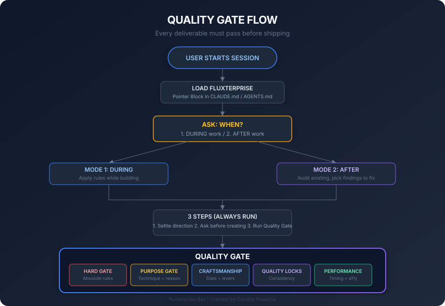
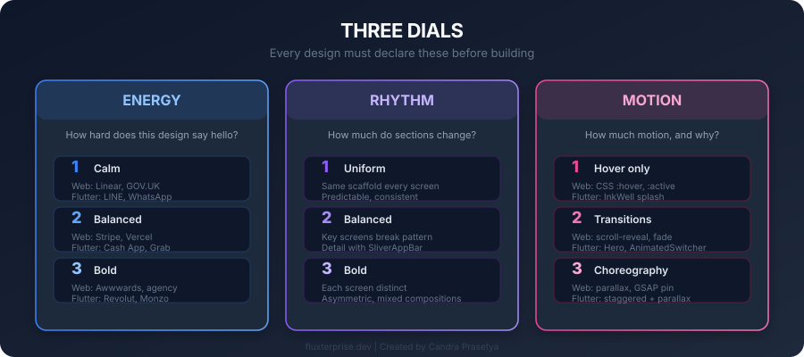
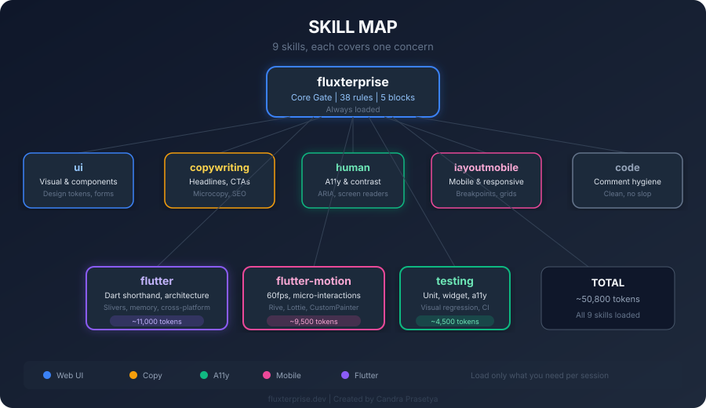
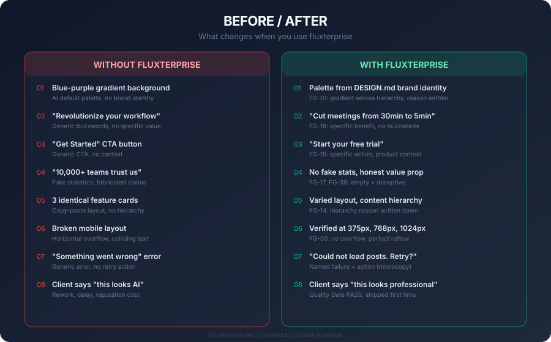

# Fluxterprise Skills

> Quality gate system for AI coding agents. Enforce craft standards before any UI ships. Extended with Flutter enterprise conventions.
>
> Created by **Candra Prasetya**

---

## Why Fluxterprise?

AI coding agents generate UI fast. But the output is recognizable: the same blue-purple gradient, the same 3-step "How It Works", the same pill-shaped buttons, the same empty states that say "No data available". It looks fine in screenshots. It falls apart in production.

Fluxterprise is not a style guide. It is a **quality gate**. Every deliverable must pass a five-block check before it ships. A single FAIL blocks delivery. The gate cannot be delegated, skipped, or replaced.

**Without fluxterprise:**

```
User: "Build me a landing page"
Agent: *generates page with blue-purple gradient, fake stats, generic CTAs, broken mobile layout*
User: "This looks AI-generated"
Agent: *makes it worse*
```

**With fluxterprise:**

```
User: "Build me a landing page"
Agent: "When do you want fluxterprise to apply? During or after?"
User: "During"
Agent: *applies quality gate at every step*
Agent: "QUALITY GATE REPORT:
  FG-02 PASS: no em dashes in copy
  FG-03 PASS: mobile layout verified at 375px, 768px, 1024px
  FG-17 PASS: no fabricated statistics
  FG-25 PASS: all text contrast verified with checker
  FG-31 PASS: every decision has a one-line reason
  ...all blocks PASS"
User: *receives deliverable that passes all checks*
```

---

## How It Works



### The Quality Gate

Every deliverable must pass five blocks:

| Block | What It Checks | Failure = |
|-------|---------------|-----------|
| **1. Hard Gate** | Em dash, mobile responsiveness, fabricated claims, dead controls, missing UI states, keyboard accessibility | Ship blocker. Fix before anything else. |
| **2. Purpose Gate** | Every technique has a written reason. Gradients, icons, typography, animations, glassmorphism must serve a purpose. | Technique without purpose. Write the reason or remove the technique. |
| **3. Craftsmanship** | ENERGY / RHYTHM / MOTION dials set and consistent. One focal point per screen. Whitespace is structural. Identity motif present. | Sterile or generic output. Add craft, not more bans. |
| **4. Quality Locks** | Intentionality, completeness, resilience, evidence. Every decision has a one-line reason. | Unexplained decisions. Write the reason. |
| **5. Performance** | Web: LCP < 2.5s, CLS < 0.1, bundle < 200KB. Flutter: 60fps, build < 1ms, MediaQuery scoped. A11y: axe-core passes. | Slow or inaccessible. Optimize before shipping. |

### The Three Dials

Every design must declare three dials before building:



---

## Skills



9 skills, each covers one concern:

| Skill | What It Covers | Load When |
|-------|---------------|-----------|
| **`fluxterprise`** | Core gate: purpose test, three tiers, Quality Gate, 38 rules | Always |
| **`fluxterprise-ui`** | Color, layout, components, decoration, design tokens, forms | Building or editing any interface |
| **`fluxterprise-copywriting`** | Headlines, CTAs, tone, microcopy, SEO copy, anti-AI patterns | Writing or editing prose |
| **`fluxterprise-human`** | Contrast, keyboard, focus, ARIA, screen readers, motion sensitivity | Ensuring UI works for real people |
| **`fluxterprise-layoutmobile`** | Breakpoints, scale, grids, overflow, tap targets | Layouts that reflow across screen sizes |
| **`fluxterprise-code`** | Code comment hygiene | Writing or editing code comments |
| **`fluxterprise-flutter`** | Dart shorthand, architecture, code quality, Slivers, memory, cross-platform | Building or editing Flutter apps |
| **`fluxterprise-flutter-motion`** | 60fps, micro-interactions, Rive/Lottie, CustomPainter, cross-platform motion | Adding animation or motion to Flutter |
| **`fluxterprise-testing`** | Unit, widget, integration, accessibility, visual regression testing | Writing tests or validating deliverables |

---

## Before / After Examples



### Example 1: Landing Page Hero

**Without fluxterprise:**

```
Agent output:
- Blue-purple gradient background
- "Revolutionize your workflow" headline
- "Get Started" CTA button
- Fake stat: "10,000+ teams trust us"
- 3 feature cards with identical layout
- Broken on mobile (text overflows)
```

**With fluxterprise:**

```
Agent output:
- Background derived from DESIGN.md brand palette (FG-01)
- "Cut your team's status meetings from 30min to 5min" headline (FG-16)
- "Start your free trial" CTA (FG-15)
- No fake stats, honest value prop instead (FG-17, FG-38)
- 3 feature cards with varied layout reflecting content hierarchy (FG-14)
- Mobile layout verified at 375px, no overflow (FG-03)
- Every decision has a one-line reason written down (FG-31)
```

### Example 2: Flutter Screen

**Without fluxterprise:**

```dart
// Agent output:
class PostsScreen extends StatefulWidget {
  @override
  _PostsScreenState createState() => _PostsScreenState();
}

class _PostsScreenState extends State<PostsScreen> {
  List<Post> posts = [];
  bool isLoading = true;
  String error = '';

  @override
  void initState() {
    super.initState();
    fetchPosts(); // API call in initState
  }

  Future<void> fetchPosts() async {
    try {
      final response = await http.get(Uri.parse('https://api.example.com/posts'));
      setState(() {
        posts = jsonDecode(response.body);
        isLoading = false;
      });
    } catch (e) {
      setState(() { error = e.toString(); isLoading = false; });
    }
  }

  @override
  Widget build(BuildContext context) {
    return Scaffold(
      body: isLoading
          ? CircularProgressIndicator()  // bare spinner, no text
          : error.isNotEmpty
              ? Text('Error: $error')     // generic error
              : ListView(children: posts.map((p) => Text(p.title)).toList()),
    );
  }
}
```

**With fluxterprise:**

```dart
// Agent output (fluxterprise-flutter applied):

// 1. Feature-first architecture (FR-02)
// 2. Cubit-only state (FR-03)
// 3. GetIt DI (FR-04)
// 4. fpdart Either for error handling (FR-05)
// 5. Three UI states (FR-06)
// 6. Two-widget page pattern (FR-11)
// 7. GoRouter navigation (FR-12)
// 8. Dart shorthand (records, switch expressions)
// 9. MediaQuery scoped (performance)
// 10. Const constructors (memory)

// posts_cubit.dart
@freezed
sealed class PostsState with _$PostsState {
  const factory PostsState.initial() = PostsInitial;
  const factory PostsState.loading() = PostsLoading;
  const factory PostsState.loaded(List<Post> posts) = PostsLoaded;
  const factory PostsState.error(String message) = PostsError;
}

class PostsCubit extends Cubit<PostsState> {
  PostsCubit(this._getPosts) : super(const PostsState.initial());
  final GetPosts _getPosts;

  Future<void> load() async {
    emit(const PostsState.loading());
    final result = await _getPosts(const NoParams());
    result.match(
      (failure) => emit(PostsState.error(_messageFor(failure))),
      (posts) => emit(PostsState.loaded(posts)),
    );
  }

  String _messageFor(Failure failure) => switch (failure) {
    ServerFailure(:final message) => message,
    NetworkFailure() => 'No internet connection',
  };
}

// posts_page.dart
class PostsPage extends StatelessWidget {
  const PostsPage({super.key});

  @override
  Widget build(BuildContext context) {
    return BlocProvider(
      create: (_) => getIt<PostsCubit>()..load(),
      child: const _PostsView(),
    );
  }
}

class _PostsView extends StatelessWidget {
  const _PostsView();

  @override
  Widget build(BuildContext context) {
    return Scaffold(
      appBar: AppBar(title: const Text('Posts')),
      body: BlocBuilder<PostsCubit, PostsState>(
        builder: (context, state) => switch (state) {
          PostsInitial() || PostsLoading() => const _LoadingView(),
          PostsError(:final message) => _ErrorView(
            message: message,
            onRetry: () => context.read<PostsCubit>().load(),
          ),
          PostsLoaded(:final posts) => posts.isEmpty
              ? const _EmptyView()
              : _PostList(posts: posts),
        },
      ),
    );
  }
}

// Three UI states (FR-06)
class _LoadingView extends StatelessWidget {
  const _LoadingView();
  @override
  Widget build(BuildContext context) => const Center(
    child: Column(
      mainAxisSize: MainAxisSize.min,
      children: [
        CircularProgressIndicator(),
        SizedBox(height: 16),
        Text('Loading your posts...'), // named loading (microcopy)
      ],
    ),
  );
}

class _ErrorView extends StatelessWidget {
  const _ErrorView({required this.message, required this.onRetry});
  final String message;
  final VoidCallback onRetry;

  @override
  Widget build(BuildContext context) => Center(
    child: Column(
      mainAxisSize: MainAxisSize.min,
      children: [
        Text(message),
        const SizedBox(height: 16),
        ElevatedButton(onPressed: onRetry, child: const Text('Try again')),
      ],
    ),
  );
}

class _EmptyView extends StatelessWidget {
  const _EmptyView();
  @override
  Widget build(BuildContext context) => Center(
    child: Column(
      mainAxisSize: MainAxisSize.min,
      children: [
        const Text('No posts yet'),
        const SizedBox(height: 8),
        const Text('Write your first post to see it here'), // helpful empty state
      ],
    ),
  );
}
```

### Example 3: Code Comments

**Without fluxterprise:**

```dart
// ===============================
// USER AUTHENTICATION
// ===============================

// This function validates the user credentials
// It takes email and password as parameters
// Returns a boolean indicating success
Future<bool> validateUser(String email, String password) async {
  // Step 1: Check email format
  if (!email.contains('@')) return false;

  // Step 2: Check password length
  if (password.length < 8) return false;

  // Step 3: Call the API
  final response = await http.post(Uri.parse('/auth'), body: {'email': email, 'password': password});

  // Step 4: Return the result
  return response.statusCode == 200;
}
```

**With fluxterprise:**

```dart
// Reject logins from accounts locked after 5 failed attempts.
// The lockout resets at midnight UTC.
Future<bool> validateUser(String email, String password) async {
  if (!email.contains('@')) return false;
  if (password.length < 8) return false;

  final response = await http.post(Uri.parse('/auth'), body: {'email': email, 'password': password});
  return response.statusCode == 200;
}
```

---

## Quick Install

### Option A: OpenCode (Recommended)

```bash
npx skills add candraprasetya/fluxterprise-skills
```

This installs all skills to `~/.config/opencode/skills/` and adds the pointer block to your `AGENTS.md` automatically.

### Option B: Claude Code

```bash
# Install to your project
claude skill add candraprasetya/fluxterprise-skills

# Or install globally
claude skill add --global candraprasetya/fluxterprise-skills
```

Claude Code reads skills from `.claude/skills/` in your project. The pointer block is added to `CLAUDE.md`.

### Option C: AGY Plugin

```bash
# Install the AGY plugin
agy plugin install fluxterprise-skills

# Or add from GitHub
agy plugin add github:candraprasetya/fluxterprise-skills
```

AGY loads skills from the plugin directory and routes them to your configured agent.

### Option D: Manual

1. Clone this repo or download the `skills/` folder
2. Copy the `skills/` folder into your project root (next to `CLAUDE.md`, `AGENTS.md`, or `GEMINI.md`)
3. Add the pointer block to your entry file (see below)
4. Done

### Option E: Install Script

```bash
# From the fluxterprise-skills repo
./scripts/install.sh /path/to/your/project

# Or from your project directory
/path/to/fluxterprise-skills/scripts/install.sh .
```

### Pointer Block

If your agent doesn't auto-add the pointer block, add this at the **end** of your project's entry file (`CLAUDE.md`, `AGENTS.md`, `GEMINI.md`, etc.):

```md
<!-- fluxterprise:start -->
## fluxterprise
For UI, copy, people, mobile layout, code comments, or Flutter work, read `skills/fluxterprise/SKILL.md` (core) and then the skill for the task:
- UI / visual: `skills/fluxterprise-ui/SKILL.md`
- Copy & text: `skills/fluxterprise-copywriting/SKILL.md`
- People: `skills/fluxterprise-human/SKILL.md`
- Mobile / responsive: `skills/fluxterprise-layoutmobile/SKILL.md`
- Code comments: `skills/fluxterprise-code/SKILL.md`
- Flutter specific: `skills/fluxterprise-flutter/SKILL.md`
- Flutter motion: `skills/fluxterprise-flutter-motion/SKILL.md`
- Testing: `skills/fluxterprise-testing/SKILL.md`
Before starting, ask the user when fluxterprise applies: during the work, or after it is done.
<!-- fluxterprise:end -->
```

---

## Flutter Enterprise Conventions

The `fluxterprise-flutter` skill enforces patterns from the [Flutter Enterprise Starter Kit](https://github.com/nicolinx/flutter_enterprise_starter_kit):

| Concern | Convention |
|---------|-----------|
| **Architecture** | Feature-first clean architecture (`data/`, `domain/`, `presentation/`) |
| **Dependency direction** | `presentation` → `domain` ← `data`. Domain depends on nothing external. |
| **State** | Cubit-only (not full Bloc), freezed sealed states, exhaustive `switch` |
| **DI** | GetIt with manual registration, per-feature injection files |
| **Navigation** | GoRouter with centralized `RoutePaths` constants |
| **Theming** | Material 3 `ColorScheme.fromSeed`, `AppColors`, `AppTextStyles` |
| **Error Handling** | Data sources throw typed exceptions. Repositories catch and return `Either<Failure, T>` via fpdart. Cubits never try/catch. |
| **Networking** | Dio with interceptors (error, logging, retry). NetworkInfo wraps connectivity_plus. |
| **Local Cache** | Hive CE, storing plain `toJson()` maps. No hand-rolled TypeAdapters. |
| **Testing** | mocktail + bloc_test, mocks one layer down only. Tests mirror lib/ structure 1:1. |
| **Code Gen** | `@freezed` + `@JsonSerializable`, `build_runner`. Never hand-edit generated files. |
| **Linting** | `very_good_analysis` (strict). No `var`/`dynamic`, `final`-first, `const` everywhere, no `!` bang. |
| **Imports** | Absolute package paths (`package:your_app/...`). No relative imports. |
| **Pages** | Two-widget pattern: public `Page` + private `View`. Trigger loading in `BlocProvider.create`. |
| **Dart** | Records, switch expressions, enhanced enums, sealed classes, extension methods |
| **Memory** | const everywhere, dispose everything, keys on lists, scoped BlocBuilder |
| **Motion** | 60fps, Transform over layout, implicit animations first |
| **Cross-Platform** | Adaptive layout, platform curves/durations, SafeArea |
| **i18n** | gen_l10n, ARB files, `context.l10n.xxx` for all user-facing strings |
| **Flavors** | `development` + `production`, each with its own Firebase project. Dart selects config, not native files. |

---

## Craftsmanship Dials

Every design must declare three dials:

| Dial | 1 (Calm) | 2 (Balanced) | 3 (Bold) |
|------|----------|-------------|----------|
| **ENERGY** | Linear, GOV.UK | Stripe, Vercel | Awwwards, agency portfolio |
| **RHYTHM** | Uniform grid | Consistent with breaks | Asymmetric, mixed |
| **MOTION** | Hover/press only | Transitions, reveals | Parallax, choreography |

**Flutter / Mobile:**

| Dial | 1 (Calm) | 2 (Balanced) | 3 (Bold) |
|------|----------|-------------|----------|
| **ENERGY** | LINE, WhatsApp | Cash App, Grab | Revolut, Monzo |
| **RHYTHM** | Same scaffold every screen | Key screens break pattern | Each screen distinct |
| **MOTION** | InkWell splash | Hero + AnimatedSwitcher | Staggered + parallax |

---

## Project Structure

```
fluxterprise-skills/
├── README.md
├── LICENSE
├── skills/
│   ├── fluxterprise/
│   │   └── SKILL.md           # Core gate (38 rules, Quality Gate)
│   ├── fluxterprise-code/
│   │   └── SKILL.md           # Code comment hygiene
│   ├── fluxterprise-copywriting/
│   │   └── SKILL.md           # Copy, microcopy, SEO, text patterns
│   ├── fluxterprise-flutter/
│   │   └── SKILL.md           # Dart shorthand, architecture, Slivers, memory
│   ├── fluxterprise-flutter-motion/
│   │   └── SKILL.md           # 60fps, micro-interactions, Rive/Lottie, CustomPainter
│   ├── fluxterprise-human/
│   │   ├── SKILL.md           # ARIA, screen readers, motion sensitivity, contrast
│   │   ├── contrast-check.py  # WCAG contrast checker (AA + AAA, batch, JSON)
│   │   └── contrast-mcp.py    # MCP server for contrast checking
│   ├── fluxterprise-layoutmobile/
│   │   └── SKILL.md           # Mobile responsive layout
│   ├── fluxterprise-testing/
│   │   └── SKILL.md           # Unit, widget, integration, a11y, visual regression
│   └── fluxterprise-ui/
│       └── SKILL.md           # Design tokens, forms, components, motion
├── scripts/
│   └── install.sh             # One-line installer
└── docs/
    └── FLUTTER-CONVENTIONS.md # Detailed Flutter conventions reference
```

---

## Adding a New Skill

1. Create `skills/your-skill/SKILL.md`
2. Follow the pattern: **Tell** (the pattern), **Why** (why it falls below the gate), **Fix** (what to do instead)
3. Reference core rules by number (`FG-XX`), never renumber
4. Add a checklist at the end of the file
5. Update the pointer block in your entry file to include the new skill

---

## Versioning

Skills version together with the core fluxterprise system. A newer skill never mixes with an older core. If you update, update everything.

---

## Pros & Cons

### With Fluxterprise

| Pros | Cons |
|------|------|
| Every deliverable passes a quality gate before shipping | Adds ~30-60 seconds to each deliverable (gate must run) |
| No more "looks AI-generated" feedback from clients | Agent must read skill files first (one-time per session) |
| Consistent output across sessions and agents | Rules are strict: a single FAIL blocks delivery |
| Accessibility built-in, not bolted on at the end | More tokens consumed per session (skills are loaded into context) |
| Flutter code follows enterprise architecture from the start | Requires DESIGN.md for best results (extra setup step) |
| Performance checked before shipping (Core Web Vitals, 60fps) | Learning curve for the three-dial system (ENERGY/RHYTHM/MOTION) |
| Every decision has a written reason (audit trail) | Some rules may conflict with client's existing design system |
| Cross-platform consistency (web, iOS, Android, macOS, Windows) | Not a replacement for human QA: the gate catches AI patterns, not all bugs |
| Microcopy, forms, and data tables covered (not just landing pages) | Flutter skills assume Cubit/GetIt/GoRouter stack (alternative stacks need manual adaptation) |
| Testing patterns included (unit, widget, integration, a11y, visual regression) | Overkill for throwaway prototypes or quick POCs |

### Without Fluxterprise

| Pros | Cons |
|------|------|
| Faster initial output (no gate overhead) | Output looks generic and AI-generated |
| No setup required (just start coding) | Broken mobile layouts ship undetected |
| Works with any stack, no assumptions | Fake testimonials, fabricated stats, dead controls |
| Lower token usage per session | No accessibility enforcement (contrast, keyboard, screen readers) |
| No learning curve | No performance checks (bundle size, frame timing) |
| Good enough for throwaway prototypes | Client says "this looks AI" and you redo everything |
| | No consistency across sessions (different output every time) |
| | No testing guidance (tests are an afterthought) |
| | No microcopy standards (error messages say "Something went wrong") |
| | Architecture decisions left to the agent (often wrong) |

### When to Use vs. When to Skip

| Scenario | Use Fluxterprise? | Why |
|----------|-------------------|-----|
| Client project (paid) | **Yes** | Client expects quality. "Looks AI" is a rejection. |
| Production app | **Yes** | A11y, performance, and testing are not optional. |
| Internal tool / dashboard | **Yes** (lighter) | Skip the copywriting skill, keep the rest. |
| Throwaway prototype | No | Speed matters more than quality. |
| Quick POC / hackathon | No | Ship fast, refactor later with fluxterprise. |
| Open source library | **Yes** | Code quality and documentation standards matter. |
| Freelance / agency work | **Yes** | Deliverable quality = reputation. |
| Learning / tutorial | No | Focus on learning, not gate compliance. |

---

## Token Usage Estimates

Fluxterprise skills are loaded into the agent's context window. Here's how much tokens each skill consumes, and estimated total cost per session.

### Per-Skill Token Count

| Skill | Lines | Est. Tokens | Notes |
|-------|-------|-------------|-------|
| `fluxterprise` (core) | ~690 | ~8,500 | Always loaded. 38 rules + Quality Gate. |
| `fluxterprise-ui` | ~400 | ~5,000 | Visual patterns, design tokens, forms. |
| `fluxterprise-copywriting` | ~430 | ~5,500 | Copy patterns, microcopy, SEO. |
| `fluxterprise-human` | ~230 | ~3,000 | ARIA, contrast, motion sensitivity. |
| `fluxterprise-layoutmobile` | ~175 | ~2,200 | Mobile layout patterns. |
| `fluxterprise-code` | ~130 | ~1,600 | Code comment hygiene. |
| `fluxterprise-flutter` | ~900 | ~11,000 | Dart shorthand, architecture, Slivers, memory. |
| `fluxterprise-flutter-motion` | ~750 | ~9,500 | 60fps, Rive/Lottie, CustomPainter. |
| `fluxterprise-testing` | ~350 | ~4,500 | Unit, widget, integration, a11y, visual regression. |
| **Total (all skills)** | **~4,055** | **~50,800** | |

### Session Token Budget

A typical session loads the core + 2-3 relevant skills:

| Session Type | Skills Loaded | Skill Tokens | Conversation Tokens | Total Tokens |
|-------------|---------------|-------------|-------------------|-------------|
| **Web UI task** | core + ui + copywriting + human | ~22,000 | ~15,000-30,000 | **~37,000-52,000** |
| **Flutter app** | core + flutter + flutter-motion + testing | ~33,500 | ~20,000-40,000 | **~53,500-73,500** |
| **Full stack** | core + ui + flutter + testing | ~29,000 | ~25,000-50,000 | **~54,000-79,000** |
| **Audit only** | core + ui + human | ~16,500 | ~10,000-20,000 | **~26,500-36,500** |
| **Minimal** | core only | ~8,500 | ~10,000-20,000 | **~18,500-28,500** |

### Cost Estimate by Model

Prices as of September 2026. Input token cost only (output tokens vary by task).

| Model | Input Price | Web UI Session | Flutter Session | Full Stack Session |
|-------|------------|---------------|----------------|-------------------|
| **Claude 3.5 Sonnet** | $3/1M tokens | ~$0.11-0.16 | ~$0.16-0.22 | ~$0.16-0.24 |
| **Claude 3 Opus** | $15/1M tokens | ~$0.56-0.78 | ~$0.80-1.10 | ~$0.81-1.19 |
| **GPT-4o** | $2.50/1M tokens | ~$0.09-0.13 | ~$0.13-0.18 | ~$0.14-0.20 |
| **GPT-4o mini** | $0.15/1M tokens | ~$0.006-0.008 | ~$0.008-0.011 | ~$0.008-0.012 |
| **Gemini 1.5 Pro** | $1.25/1M tokens | ~$0.05-0.07 | ~$0.07-0.09 | ~$0.07-0.10 |
| **MiMo (Xiaomi)** | ~$0.50/1M tokens | ~$0.02-0.03 | ~$0.03-0.04 | ~$0.03-0.04 |
| **DeepSeek V3** | ~$0.27/1M tokens | ~$0.01-0.01 | ~$0.01-0.02 | ~$0.01-0.02 |

### Token Optimization Tips

1. **Load only what you need.** Don't load all 9 skills for a copy-only task.
2. **Use the pointer block.** The agent reads the pointer block (~200 tokens) and decides which skills to load, instead of loading everything.
3. **Fluxterprise-flutter is the heaviest** (~11,000 tokens). If you're only doing Dart code (no UI), skip the flutter-motion skill.
4. **Skills are loaded once per session.** After the first read, they're in context for the entire session. The cost is front-loaded.
5. **Use `--selftest` on contrast-check.py** instead of loading the full reference table into the conversation.

### Without Fluxterprise (Token Savings)

| Scenario | Without Fluxterprise | With Fluxterprise | Overhead |
|----------|---------------------|-------------------|----------|
| Web UI session | ~15,000-30,000 tokens | ~37,000-52,000 tokens | **+47-73%** |
| Flutter session | ~20,000-40,000 tokens | ~53,500-73,500 tokens | **+67-84%** |
| Full stack session | ~25,000-50,000 tokens | ~54,000-79,000 tokens | **+58-68%** |

The overhead is the cost of quality. A single "this looks AI-generated" rejection from a client costs more in rework than the token overhead across 100 sessions.

---

## Next Plan

### Q4 2026

- [ ] **`fluxterprise-perf`** — Dedicated performance skill: Core Web Vitals deep-dive, bundle optimization, lazy loading strategies, image optimization (WebP/AVIF), caching patterns, Flutter frame profiling
- [ ] **`fluxterprise-designsystem`** — Design system skill: component inventory, token architecture documentation, versioning strategy, Figma-to-code bridge, design system governance
- [ ] **`fluxterprise-api`** — API integration skill: error handling for network requests, loading state management, optimistic updates, offline-first patterns, retry strategies, pagination patterns
- [ ] **`fluxterprise-ci`** — CI/CD integration skill: automating the Quality Gate in CI, lint rules that enforce the gate, pre-commit hooks, deployment checks, coverage thresholds
- [ ] **Contrast Checker v2** — Web UI for contrast checking, Figma plugin, design token export

### Q1 2027

- [ ] **`fluxterprise-flutter-web`** — Flutter web specifics: URL strategy, browser history, SEO for Flutter web, PWA configuration, web-only widget patterns
- [ ] **`fluxterprise-flutter-state`** — Alternative state management: Riverpod, Provider, injectable, auto_route guidance for teams not using Cubit/GetIt/GoRouter
- [ ] **Visual Regression CI** — Golden test CI pipeline: platform-specific rendering, diff reporting, automatic baseline updates
- [ ] **A11y Automation** — axe-core integration for web, flutter_test accessibility checks automation, WCAG AAA audit tooling

### Q2 2027

- [ ] **`fluxterprise-flutter-native`** — Platform channels, native module integration, platform-specific UI patterns (Cupertino widgets, Material You dynamic color)
- [ ] **`fluxterprise-data-viz`** — Data visualization skill: chart selection, color accessibility in charts, responsive chart behavior, chart animation patterns
- [ ] **Fluxterprise CLI** — `fluxterprise check` command: runs all Quality Gate checks, outputs PASS/FAIL report, integrates with CI
- [ ] **MCP Server** — Full fluxterprise MCP server: real-time Quality Gate checking, contrast checking, lint rules, performance monitoring

### Community

- [ ] **Skill marketplace** — Community-contributed skills with versioning and compatibility checks
- [ ] **Template library** — Pre-built DESIGN.md templates for common product types (SaaS, e-commerce, fintech, health, education)
- [ ] **IDE integration** — VS Code extension with inline Quality Gate feedback

---

## License

MIT
